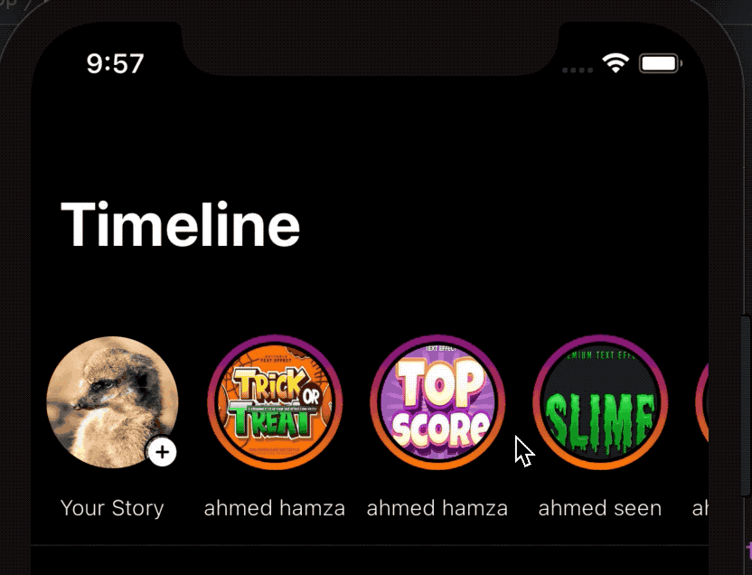

# IGStoriesView

## Summary
 
IGStoriesView is a simple stories card reusable component with many features and easy way of integration. 

## Getting started
To get started, you will need to setup cocoapods and pod install IGStoriesView

```
pod 'IGStoriesView'
```
## Supported Platform 

 .iOS(.v12) and later
 
### How to integrate in your UIViewController

1- add reference to `IGStoriesView` in your xib or storyboard


```swift
 @IBOutlet weak var storyCardView: IGStoriesCardView!
```

2- pass the list of stories view models of type `IGStoriesViewModel`

```swift

public struct IGStoriesViewModel {
    var image: String?
    var name: String?
    var isSeen: Bool?
    var userId: String?
}

```


Then add to your VC

```swift
storyCardView.storiesViewModels = allStories
storyCardView.delegate = self
```

to listen to the action of openeing one story you should set delegate of type `IGStoriesCollectionViewActionsDelegate`

Example
```swift

extension ViewController: IGStoriesCollectionViewActionsDelegate {
    func collectionView(_ collectionView: UICollectionView, didSelect userId: String?) {
        // present your story here
    }
}

```
 That's all you should see 

{: style="width:250px"}
